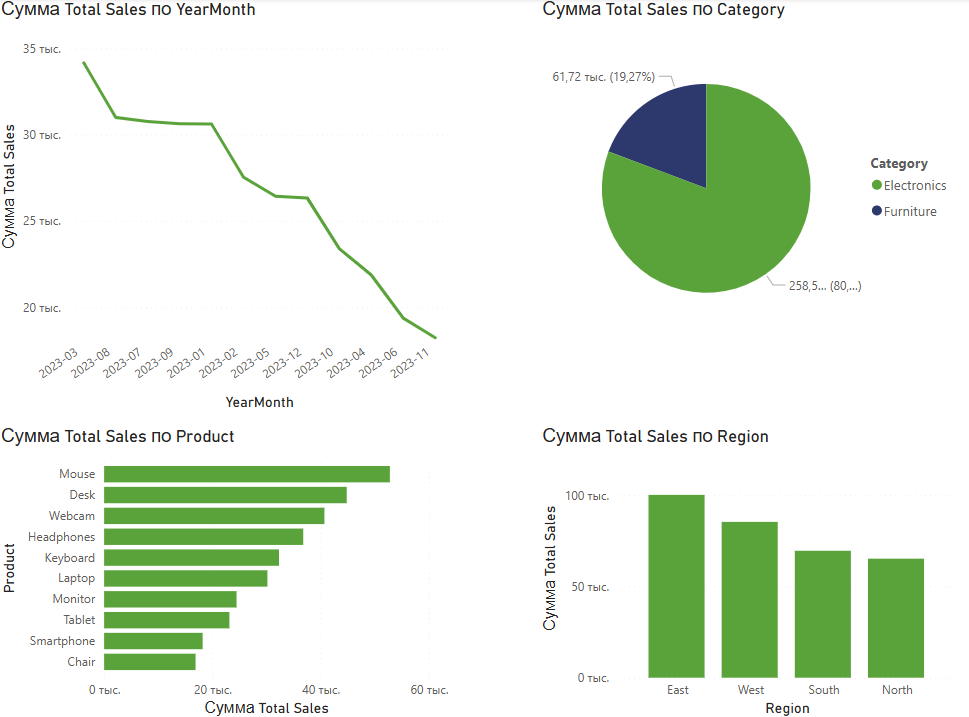

# 📊 Ecommerce Sales Dashboard (Power BI)

This project showcases a fully interactive Power BI dashboard built from scratch using ecommerce sales data.

## 🔍 Overview
The dashboard visualizes sales performance for 2023 and includes:

- 📈 Revenue trend by month  
- 🏆 Top 10 products by sales  
- 🧩 Category distribution (Electronics vs Furniture)  
- 🌍 Regional sales breakdown  
- 🎛 Interactive filters (Region, Category, Month)

## 🛠 Tools Used
- Power BI Desktop  
- Microsoft Excel  
- DAX for calculated columns & formatting  
- Git & GitHub

## 📂 Files
- `ecommerce_sales_data.xlsx` – Source data  
- `ecommerce_dashboard.pbix` – Power BI file  
- `screenshots/` – Dashboard visuals  
- `README.md` – Project description

## 💡 Insights Found
- March was the highest-performing sales month
- Electronics generated over 80% of total revenue
- East region leads in total sales
- West region has the highest returns

## 📸 Dashboard Preview

## 🚀 Author
Created by [Dmitrii Drugov](https://www.upwork.com/freelancers/~01e7ffdf2b86f72f1a)  
Data Analyst | Power BI | Excel | SQL | Python
